# Practice_WatchKit

[Hacking with watchOS](https://www.hackingwithswift.com/store/hacking-with-watchos)

### Chapter 1

### Chapter 2

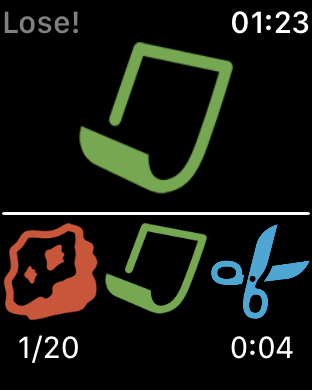

### Chapter 3

UserDefaults, KeychainWrapper

### Chapter 4

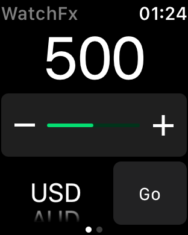

### Chapter 5

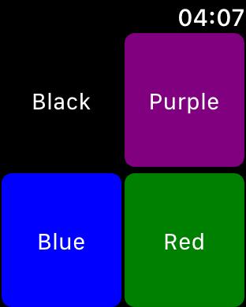

### Chapter 6

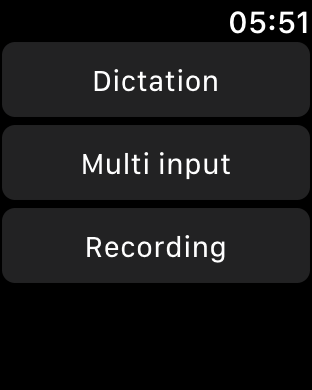

### Chapter 7

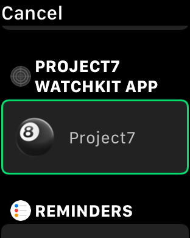

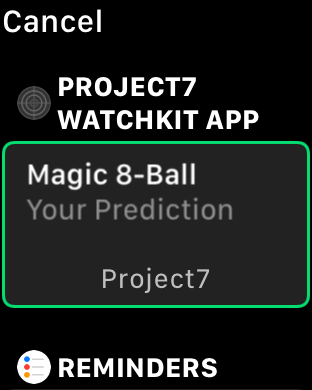

### Chapter 8

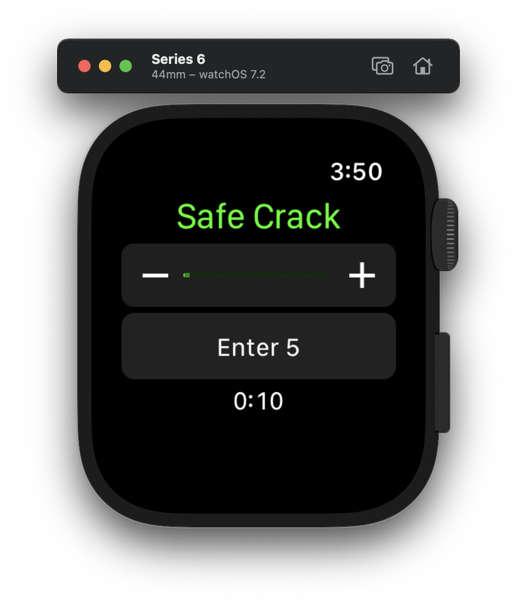

### Chapter 9

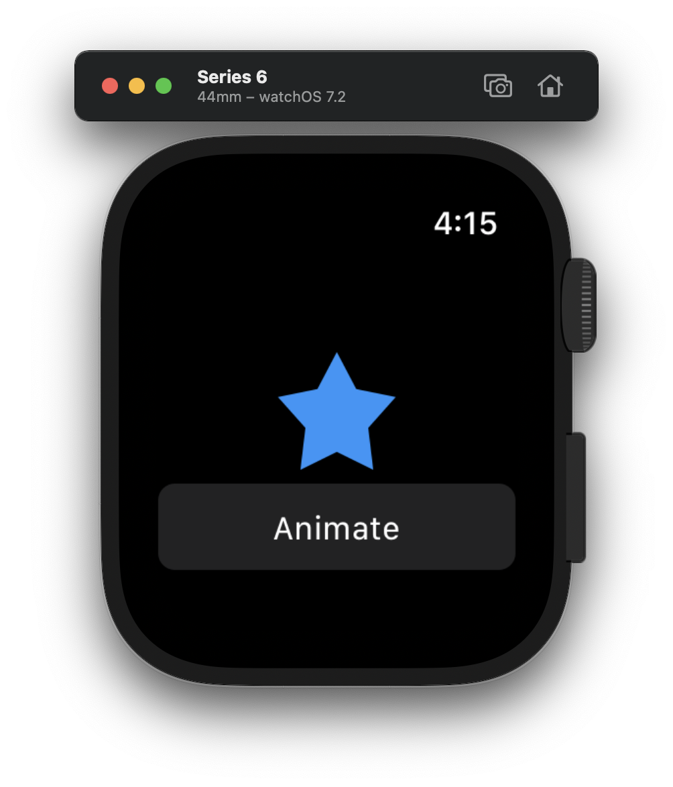

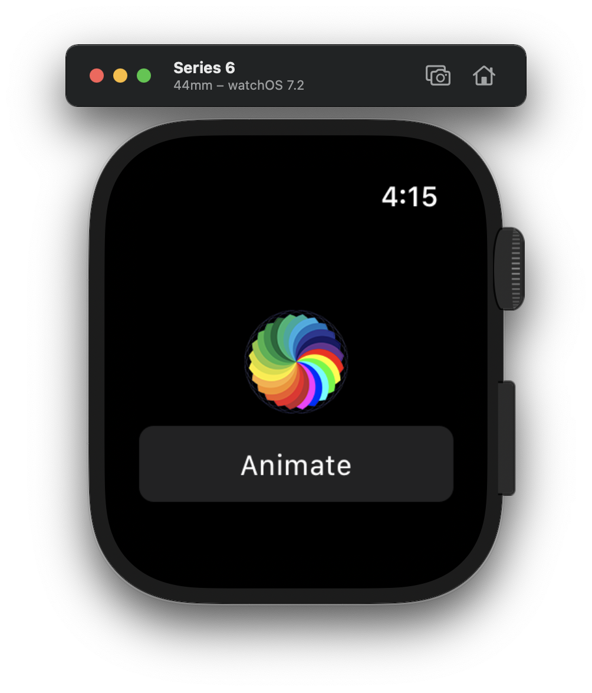

### Chapter 10

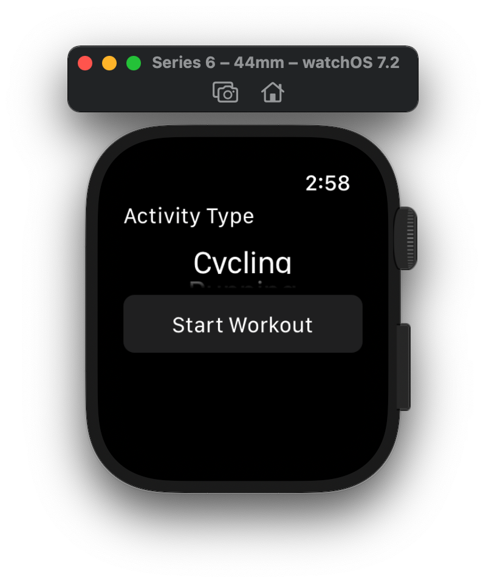

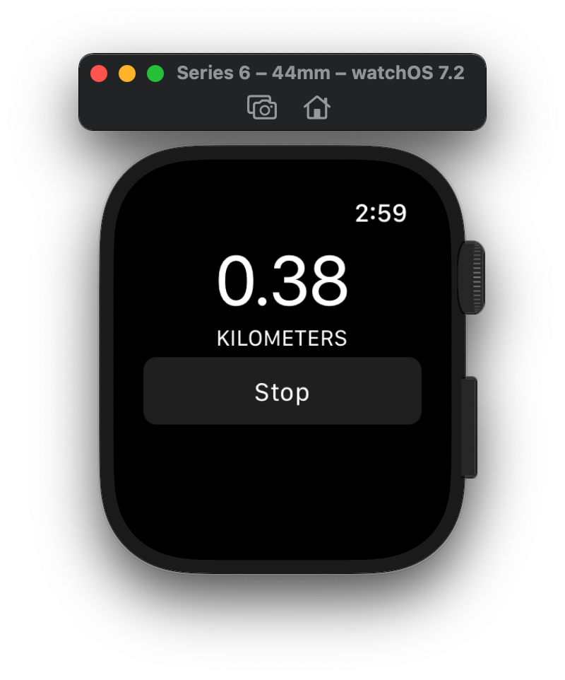

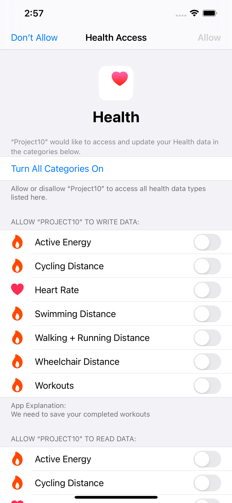

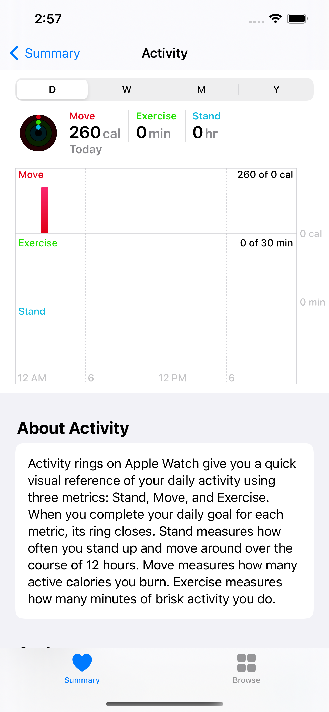

### Chapter 11

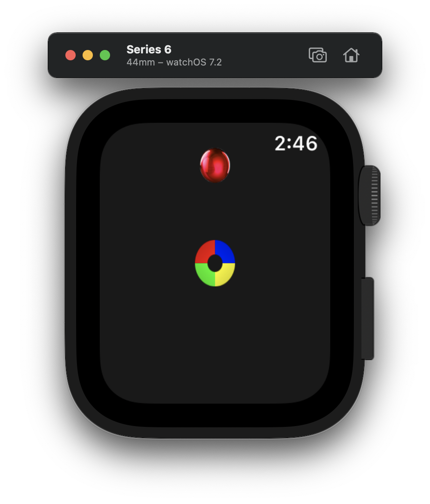

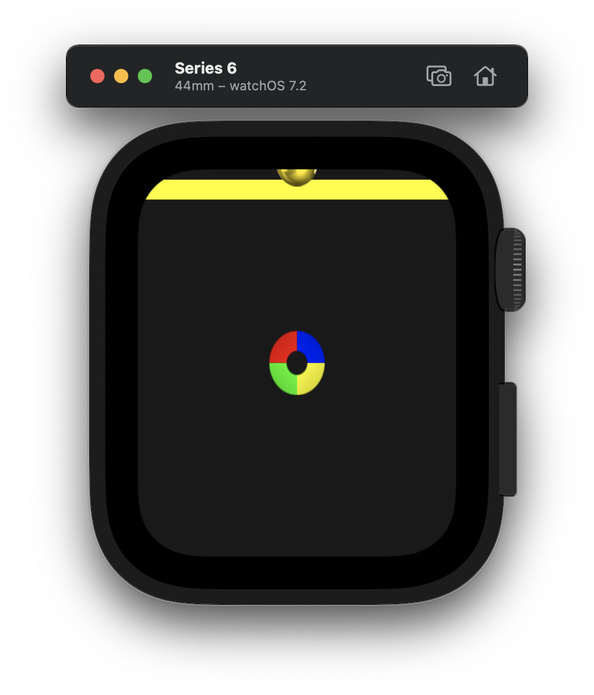

